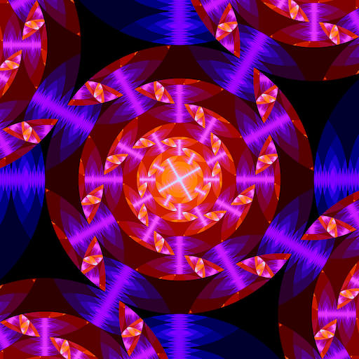

<h1 align="center"><code>degenerate</code></h1>
<div align="center">A generative image programming language</div>

## Quick Start

- Install `rustup` by following the instructions [here](https://rustup.rs/).
- Run `cargo install degenerate`
- Run a degenerate program:
  ```
    degenerate resize:1024 rotate-color:g:0.05 circle scale:0.5 wrap \
    for:8 apply loop \
    rotate-color:b:0.05 \
    for:8 apply loop \
    save
  ```
- Open `memory.png`, which should look like this:

  

Please consulte the
[Degenerate Programmer's Manual](https://degenerate.computer/man) for more
information.

## Compiling

`degenerate` can render to a terminal or to a window. To render to a window,
`degenerate` must be built with the optional `window` feature.

## Credits

`degenerate` is written by [Casey Rodarmor](https://rodarmor.com) and
[Liam Scalzulli](https://liam.rs).

## Prior Art

Degenerate builds on the techniques used in
[casey/blaster](https://github.com/casey/blaster), an audio-reactive visuals
engine.
