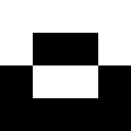

# degenerate

Degenerate is an algorithmic image generator base on image filter chains. It is inspired by [blaster](https://github.com/casey/blaster).

## Usage

Filters are parsed from `:`-separated arguments, for instance:

```bash
$ cargo run -- --output output.png resize:256:256 top square
```

will resize a matrix of pixels to be `256` columns and `256` rows and apply the
`top` and `square` filters consecutively. The `top` filter will invert the pixels
in the top half of the image and the `square` filter will produce a square in
the images center. This ultimately produces the following output:

<br/>
<div align="center">
  
</div>
<br/>

The single best source for learning how each filter works is
[integration.rs](https://github.com/casey/degenerate/blob/master/tests/integration.rs),
where integration tests are written for each `degenerate` filter.
