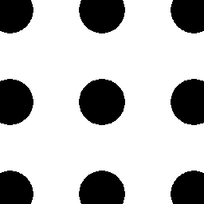

# degenerate

Degenerate is an algorithmic image generator inspired by
[blaster](https://github.com/casey/blaster).

(N.B. blaster is written in idiosyncratic Objective-C++.)

## Compiling

`degenerate` can render to a terminal or to a window. To render to a window,
`degenerate` must be built with the optional `window` feature.

## Usage

```bash
$ degenerate [COMMAND]...
```

`COMMAND`s may take zero or more `:`-separated arguments, and are currently
undocumented. The best way to learn what they do is to peruse the [image
tests](images). The name of each image is the `degenerate` program that
produced it. The image tests are reproduced below, with each preceded by its
`degenerate` invocation.

## Gallery

```
$ degenerate rotate-color:g:0.5 all apply save
```


```
$ degenerate autosave x apply cross apply load:0.png save
```


```
$ degenerate scale:2 x apply save
```


```
$ degenerate comment:slow x rotate-color:g:0.07 rotate:0.07 for:10 apply loop rotate-color:b:0.09 rotate:0.09 for:10 apply loop save
```


```
$ degenerate rotate-color:red:0.5 all apply save
```


```
$ degenerate comment:slow seed:19798 rotate-color:g:0.01 rotate:0.01 for:100 random-mask apply loop rotate-color:b:0.01 rotate:0.01 for:100 random-mask apply loop save
```


```
$ degenerate top apply save
```


```
$ degenerate rotate-color:green:1.0 all save
```


```
$ degenerate all apply save
```


```
$ degenerate rotate:1.0 square apply save
```


```
$ degenerate rotate-color:red:1.0 all save
```


```
$ degenerate square apply top apply save
```


```
$ degenerate rows:1:1 apply save
```


```
$ degenerate comment:slow rotate:0.3333 rotate-color:g:0.05 circle scale:0.5 wrap for:8 apply loop rotate:0.8333 rotate-color:b:0.05 for:8 apply loop save
```


```
$ degenerate seed:2 random-mask apply save
```


```
$ degenerate rotate:0.05 square for:2 apply loop x for:1 apply loop save
```


```
$ degenerate rotate-color:b:0.5 all apply save
```


```
$ degenerate comment:slow circle scale:0.5 for:8 apply loop save
```


```
$ degenerate random-mask apply save
```


```
$ degenerate rotate:0.125 square apply save
```


```
$ degenerate rotate:0.05 scale:2 x apply save
```


```
$ degenerate rotate-color:blue:1.0 all apply save
```


```
$ degenerate comment:slow rotate:0.111 for:16 square apply circle apply loop save
```


```
$ degenerate comment:slow circle scale:0.5 for:8 apply wrap loop save
```


```
$ degenerate rotate-color:blue:0.5 all apply save
```


```
$ degenerate scale:0.5 circle wrap apply save
```


```
$ degenerate comment:slow seed:12462 rotate-color:g:0.1 rotate:0.1 for:10 random-mask apply loop rotate-color:b:0.1 rotate:0.1 for:10 random-mask apply loop save
```


```
$ degenerate circle apply save
```


```
$ degenerate resize:512 save
```


```
$ degenerate autosave resize:256 x apply load:0.png save
```


```
$ degenerate mod:3:0 apply save
```


```
$ degenerate apply save
```


```
$ degenerate resize:512:256 rotate:0.05 x apply save load save
```


```
$ degenerate rotate-color:green:0.5 all apply save
```


```
$ degenerate cross apply save
```


```
$ degenerate rows:18446744073709551615:18446744073709551615 apply save
```


```
$ degenerate resize:3 default:0:255:0 scale:0.5 apply save
```


```
$ degenerate rotate:0.05 square for:2 apply loop save
```


```
$ degenerate default:0:255:0 resize:512 save
```


```
$ degenerate comment:slow rotate-color:g:0.05 circle scale:0.75 wrap for:8 apply loop rotate:0.8333 rotate-color:b:0.05 for:8 apply loop save
```


```
$ degenerate x apply save
```


```
$ degenerate comment:slow scale:0.99 circle for:100 apply loop save
```


```
$ degenerate comment:slow generate save
```


```
$ degenerate scale:0.5 circle apply save
```


```
$ degenerate comment:slow rotate-color:g:0.05 circle scale:0.5 wrap for:8 apply loop rotate-color:b:0.05 for:8 apply loop save
```


```
$ degenerate rotate-color:r:0.5 all apply save
```


```
$ degenerate resize:512:256 save
```


```
$ degenerate scale:0.5 circle apply all scale:0.9 wrap apply save
```


```
$ degenerate comment:slow alpha:0.75 circle scale:0.5 for:8 apply wrap loop save
```


```
$ degenerate comment:foo save
```


```
$ degenerate x apply scale:0.5 wrap identity all apply save
```


```
$ degenerate rotate:0.05 x apply save
```


```
$ degenerate scale:2 rotate:0.05 x apply save
```


```
$ degenerate square apply save
```


```
$ degenerate resize:512:256 all apply save all apply load
```


```
$ degenerate alpha:0.5 x apply save
```


```
$ degenerate read save
```


```
$ degenerate comment:slow x scale:0.5 for:8 apply wrap loop save
```


```
$ degenerate comment:slow rotate-color:g:0.05 circle scale:0.75 wrap for:8 apply loop rotate-color:b:0.05 for:8 apply loop save
```


```
$ degenerate autosave square apply load:0.png x apply load:1.png save
```


```
$ degenerate save
```


```
$ degenerate comment:slow x scale:0.5 for:8 apply loop save
```

