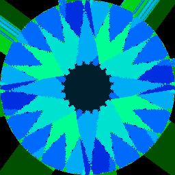
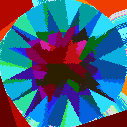
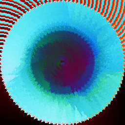

# degenerate

Degenerate is an algorithmic image generator base on image filter chains. It is inspired by [blaster](https://github.com/casey/blaster).

## Usage

```bash
$ degenerate [COMMAND]...
```

## Gallery

$ degenerate resize:256:256 random-filter save


$ degenerate resize:512:256 all save all load


$ degenerate resize:256:256 rotate-color:green:0.5 all save


$ degenerate resize:256:256 rows:1:1 save


$ degenerate resize:256:256 rotate-color:blue:0.5 all save


$ degenerate resize:256:256 save


$ degenerate resize:256:256 comment:foo save


$ degenerate resize:256:256 rotate:0.05 scale:2 x save


$ degenerate resize:256:256 rows:18446744073709551615:18446744073709551615 save


$ degenerate resize:256:256 rotate:0.05 x save


$ degenerate comment:ignore resize:256:256 rotate-color:g:0.07 rotate:0.07 for:10 x loop rotate-color:b:0.09 rotate:0.09 for:10 x loop save


$ degenerate comment:ignore resize:256:256 scale:0.99 for:100 circle loop save


$ degenerate resize:256:256 scale:2 rotate:0.05 x save


$ degenerate resize:256:256 rotate-color:red:1.0 all save


$ degenerate comment:ignore resize:256:256 rotate-color:red:0.083333 rotate:0.1 for:12 circle cross x loop save


$ degenerate resize:256:256 top save


$ degenerate resize:256:256 mod:3:0 save


$ degenerate resize:256:256 rotate:1.0 square save


$ degenerate resize:256:256 square top save


$ degenerate resize:256:256 rotate-color:r:0.5 all save


$ degenerate resize:256:256 rotate:0.125 square save


$ degenerate resize:256:256 rotate-color:red:0.5 all save


$ degenerate resize:256:256 cross save


$ degenerate resize:512:256 rotate:0.05 x save load save


$ degenerate resize:256:256 square save


$ degenerate resize:256:256 x save


$ degenerate resize:256:256 rotate-color:b:0.5 all save


$ degenerate resize:256:256 scale:2 x save


$ degenerate resize:256:256 seed:2 random-filter save


$ degenerate resize:256:256 rotate-color:g:0.5 all save


$ degenerate resize:512:256 save


$ degenerate resize:256:256 rotate-color:blue:1.0 all save


$ degenerate resize:256:256 rotate-color:green:1.0 all save


$ degenerate resize:256:256 all save


$ degenerate comment:ignore resize:256:256 rotate:0.111 for:16 square circle loop save


$ degenerate comment:ignore resize:256:256 seed:12462 rotate-color:g:0.1 rotate:0.1 for:10 random-filter loop rotate-color:b:0.1 rotate:0.1 for:10 random-filter loop save


$ degenerate comment:ignore resize:256:256 seed:19798 rotate-color:g:0.01 rotate:0.01 for:100 random-filter loop rotate-color:b:0.01 rotate:0.01 for:100 random-filter loop save


$ degenerate resize:256:256 scale:0.5 circle save


$ degenerate resize:256:256 circle save

